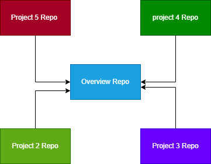

# **Overview Main Branch** 

Repository for CMPG 323 overview repository

This repository is the overview repository for the CMPG 323 module. In this repository there will be a planning and schedule of everything that is going to happen in the Future.

## Update - Creation of repositories

There will be 5 repositories created for this project. each sub project will have its own repository.
These repositories will be named:
- <a href="https://github.com/DylanNel/Project2_CMPG323_34212809"> Project2_CMPG323_34212809</a>
- Project3_CMPG323_34212809
- Project4_CMPG323_34212809

These repositories will be linked as soon as they are created and ready 

## Update - repository structure

As stated in the repository creation section, each sub project will have its own repository. These repositories will the be forked into the overview repository to give a view of the whole module and all the sub projects that were done. 

## Update - Branching strategy 

A new repository will be created for every sub project that is started for the duration of the CMPG 323 Module. 

The branching strategy that I will be using is known as a github flow strategy. I wil have one main branch and then have branches that move from my main known as feature branches. The feature branch will be deleted once the the work in the specified branch is complete. 

The idea behind the use of this branching strategy is to keep the code in the main branch in a state of constant deployability as well at to keep the main branch neat and orgainised.This strategy will work because of the small timeframe that is availible for the module requiring us to upload projects on a regular basis.

## Update - Source code and its problem solving

Sample code was added to the repository. this is code was created for an information system that solves problems with regards to stock tacking, customer database, inventory, discounts, and a database for employees.
This was accessible via the use of a GUI.

The problem solving approach we used was:
- Determine what the requirements of the information system set out by the customer 
- Design the system logically making use of diagrams 
- Create the database component of the System
- Create the UI along with the back end code for the system
- Test the system to find any errors, bugs and problems.
- Implement the system.

## Update - .gitignore and its uses 

As the name suggests, the .gitignore file contains information that are specially untracked that git should ignore.

The process of ignoring the files follows a pattern. Paterns from multiple sources are checked by git if the choice is made to ignore a path.

The .gitignore file ignores all charaters that come up most in the patterns that is searched through, these include things like comments and other symbols that may indicate file paths for example.

for the future projects, .gitignore files will be included in the repositories.

## Update - Credentials and sensitve information

The storage of credentials and sensitive information is an issue when it comes to the security of the repository. 

The first and most sensible thing to do is not to store any sensitive information in your git repository as well as implementing rules about the storage of sensitive information. The github repository can also be set up to make use of SSH keys and rotate these keys often. this will restrict unwanted access to the repository.  

There is also tools that can be used to analyse your commits like git-secrets. git-crets can also be used to break builds of your code when sensitive information is detected. tools can be used to conduct audits of your repos. These audits should be done regularly to ensure that sensitive information doesn't make its way into your repository. Be sure to also audit the code that you import to github as well since imported code can also contain sensitive information.

The addition of a security.md file to the repository. In this file the security and privacy policies can be discussed as well as how to report and disclose of issues properly, this report and disclosure section should also have a way to contact the people responsible for the management of the repo.

You can also create the github repository with security in mind and make use of the github offerings in terms of security.

## Update - Project 2 

The repository for the 2nd project for CMPG 323 has been created. The link to the repo can be found at the top of the readme. There is a development branch as well as a main branch in the repo, More code will be uploaded as the project nears completion.