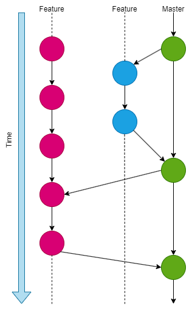

# **Overview**
Repository for CMPG 323

In this repository there will be lots of changes made over the coming weeks 

## Update
A new repository will be created for every sub project that is started for the duration of the CMPG 323 Module. 

The branching strategy that I will be using is known as a github flow strategy. I wil have one main branch and then have branches that move from my main known as feature branches. The feature branch will be deleted once the the work in the specified branch is complete. 

The idea behind the use of this branching strategy is to keep the code in the main branch in a state of constant deployability as well at to keep the main branch neat and orgainised.This strategy will work because of the small timeframe that is availible for the module requiring us to upload projects on a regular basis.

## Update
Sample code was added to the repository. this is code was used for an information system that solves problems with regards to stock tacking, customer database, inventory, discounts, and a database for employees.
This was accessible via the use of a GUI.

The problem solving approach we used was:
- Determine what the requirements of the information system set out by the customer 
- Design the system logically making use of diagrams 
- Create the database component of the System
- Create the UI along with the back end code for the system
- Test the system to find any errors, bugs and problems.
- Implement the system.
